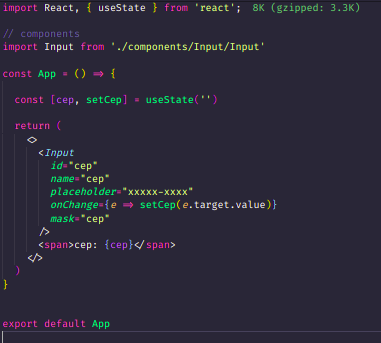

# [React](https://reactjs.org/) &middot;    

## Projeto 
- Criei um [Regex](https://regexr.com/) para cada tipo de máscara (cpf, cep e telefone)

## Post
- [Link do post](https://murilio.medium.com/máscaras-com-regex-no-reactjs-df242dbc3919) que fiz no medium explicando um pouco melhor de como utilizar as máscaras.

## Usage 
- Como usar o componente de input aplicando a máscara

